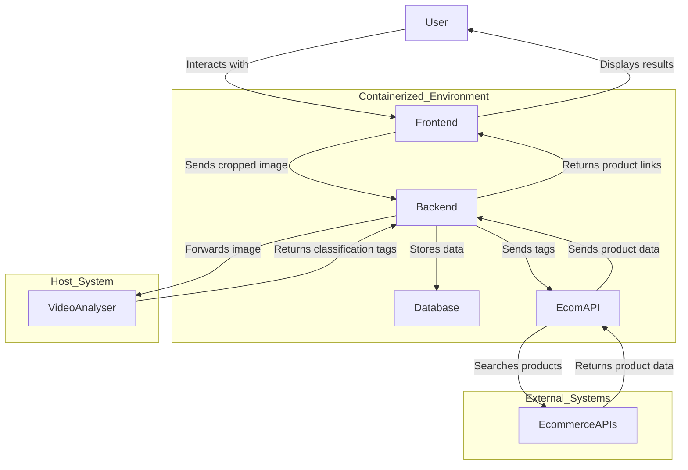
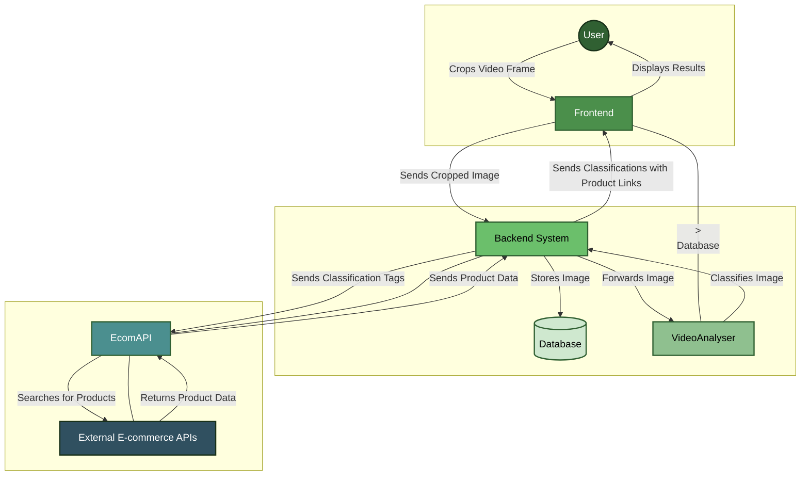

## System Architecture

```mermaid
flowchart TD
    %% Components
    User -->|Interacts with| Frontend
    Frontend -->|Sends cropped image| Backend
    Backend -->|Stores data| Database
    Backend -->|Forwards image| VideoAnalyser
    VideoAnalyser -->|Returns classification tags| Backend
    Backend -->|Sends tags| EcomAPI
    EcomAPI -->|Searches products| EcommerceAPIs
    EcommerceAPIs -->|Returns product data| EcomAPI
    EcomAPI -->|Sends product data| Backend
    Backend -->|Returns product links| Frontend
    Frontend -->|Displays results| User

    %% Containerization
    subgraph Containerized_Environment
        Frontend
        Backend
        Database
        EcomAPI
    end

    subgraph Host_System
        VideoAnalyser
    end

    %% External API
    subgraph External_Systems
        EcommerceAPIs
    end
```

## Data Flow Diagram

```mermaid
flowchart TB
    %% External Entities
    User((User)) -->|Crops Video Frame| Frontend[Frontend]

    %% Data Flow: Frontend to Backend
    Frontend -->|Sends Cropped Image| Backend[Backend System]

    %% Data Storage
    Backend -->|Stores Image| Database[(Database)]

    %% Image Classification
    Backend -->|Forwards Image| VideoAnalyser[VideoAnalyser]
    VideoAnalyser -->|Classifies Image| Backend

    %% E-commerce Search
    Backend -->|Sends Classification Tags| EcomAPI[EcomAPI]
    EcomAPI -->|Searches for Products| ExternalAPIs[External E-commerce APIs]
    ExternalAPIs -->|Returns Product Data| EcomAPI

    %% Display Results
    EcomAPI -->|Sends Product Data| Backend
    Backend -->|Sends Classifications with Product Links| Frontend
    Frontend -->|Displays Results| User

    %% Custom Styling
    classDef userStyle fill:#306032,stroke:#183018,stroke-width:2px,color:white;
    classDef frontendStyle fill:#4b8f4b,stroke:#306032,stroke-width:2px,color:white;
    classDef backendStyle fill:#6bbf6b,stroke:#306032,stroke-width:2px,color:black;
    classDef databaseStyle fill:#cfe8cf,stroke:#306032,stroke-width:2px,color:black;
    classDef videoAnalyserStyle fill:#8fc08f,stroke:#306032,stroke-width:2px,color:black;
    classDef ecomApiStyle fill:#4b8f8f,stroke:#306032,stroke-width:2px,color:white;
    classDef externalApiStyle fill:#305060,stroke:#183018,stroke-width:2px,color:white;

    %% Applying Styles to Nodes
    class User userStyle;
    class Frontend frontendStyle;
    class Backend backendStyle;
    class Database databaseStyle;
    class VideoAnalyser videoAnalyserStyle;
    class EcomAPI ecomApiStyle;
    class ExternalAPIs externalApiStyle;

    %% Adjusting Spacing
    Frontend --&gt;
    Database --- VideoAnalyser;
    Backend --- EcomAPI;
    EcomAPI --- ExternalAPIs;

    %% Adding some spacing between the rows
    subgraph Row_1[ ]
        User
        Frontend
    end

    subgraph Row_2[ ]
        Backend
        Database
        VideoAnalyser
    end

    subgraph Row_3[ ]
        EcomAPI
        ExternalAPIs
    end

```

