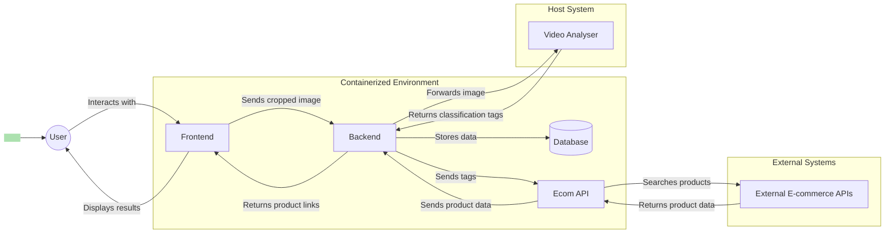
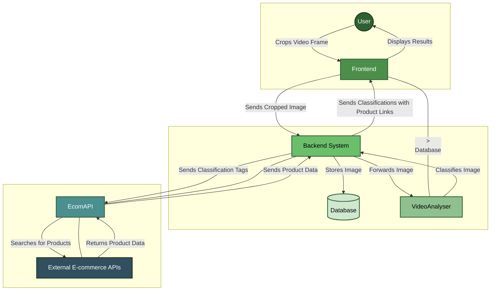
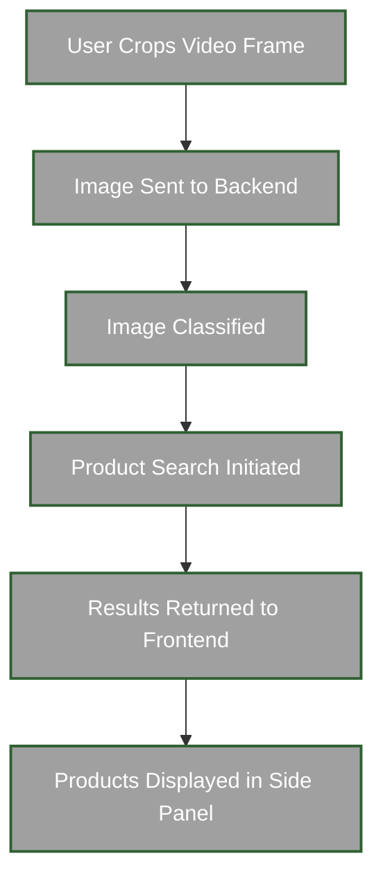

## System Architecture

```mermaid
flowchart LR
    %% Background shape to cover the canvas area
    subgraph bg[ ]
    direction LR
    classDef backgroundStyle fill:#ACE1AF,stroke-width:0px;
    end
    bg --> User

    %% Components
    User((User)) -->|Interacts with| Frontend[Frontend]
    Frontend -->|Sends cropped image| Backend[Backend]
    Backend -->|Stores data| Database[(Database)]
    Backend -->|Forwards image| VideoAnalyser[Video Analyser]
    VideoAnalyser -->|Returns classification tags| Backend
    Backend -->|Sends tags| EcomAPI[Ecom API]
    EcomAPI -->|Searches products| EcommerceAPIs[External E-commerce APIs]
    EcommerceAPIs -->|Returns product data| EcomAPI
    EcomAPI -->|Sends product data| Backend
    Backend -->|Returns product links| Frontend
    Frontend -->|Displays results| User

    %% Containerization
    subgraph Containerized_Environment[Containerized Environment]
        direction TB
        Frontend
        Backend
        Database
        EcomAPI
    end

    subgraph Host_System[Host System]
        direction TB
        VideoAnalyser
    end

    %% External API
    subgraph External_Systems[External Systems]
        direction TB
        EcommerceAPIs
    end

    %% Applying background style
    class bg backgroundStyle;

```

## Data Flow Diagram

```mermaid
flowchart TB
    %% External Entities
    User((User)) -->|Crops Video Frame| Frontend[Frontend]

    %% Data Flow: Frontend to Backend
    Frontend -->|Sends Cropped Image| Backend[Backend System]

    %% Data Storage
    Backend -->|Stores Image| Database[(Database)]

    %% Image Classification
    Backend -->|Forwards Image| VideoAnalyser[VideoAnalyser]
    VideoAnalyser -->|Classifies Image| Backend

    %% E-commerce Search
    Backend -->|Sends Classification Tags| EcomAPI[EcomAPI]
    EcomAPI -->|Searches for Products| ExternalAPIs[External E-commerce APIs]
    ExternalAPIs -->|Returns Product Data| EcomAPI

    %% Display Results
    EcomAPI -->|Sends Product Data| Backend
    Backend -->|Sends Classifications with Product Links| Frontend
    Frontend -->|Displays Results| User

    %% Custom Styling
    classDef userStyle fill:#306032,stroke:#183018,stroke-width:2px,color:white;
    classDef frontendStyle fill:#4b8f4b,stroke:#306032,stroke-width:2px,color:white;
    classDef backendStyle fill:#6bbf6b,stroke:#306032,stroke-width:2px,color:black;
    classDef databaseStyle fill:#cfe8cf,stroke:#306032,stroke-width:2px,color:black;
    classDef videoAnalyserStyle fill:#8fc08f,stroke:#306032,stroke-width:2px,color:black;
    classDef ecomApiStyle fill:#4b8f8f,stroke:#306032,stroke-width:2px,color:white;
    classDef externalApiStyle fill:#305060,stroke:#183018,stroke-width:2px,color:white;

    %% Applying Styles to Nodes
    class User userStyle;
    class Frontend frontendStyle;
    class Backend backendStyle;
    class Database databaseStyle;
    class VideoAnalyser videoAnalyserStyle;
    class EcomAPI ecomApiStyle;
    class ExternalAPIs externalApiStyle;

    %% Adjusting Spacing
    Frontend --&gt;
    Database --- VideoAnalyser;
    Backend --- EcomAPI;
    EcomAPI --- ExternalAPIs;

    %% Adding some spacing between the rows
    subgraph Row_1[ ]
        User
        Frontend
    end

    subgraph Row_2[ ]
        Backend
        Database
        VideoAnalyser
    end

    subgraph Row_3[ ]
        EcomAPI
        ExternalAPIs
    end

```

## Simple Data Flow Diagram

```mermaid
graph TD
    A["User Crops Video Frame"] --> B["Image Sent to Backend"]
    B --> C["Image Classified"]
    C --> D["Product Search Initiated"]
    D --> E["Results Returned to Frontend"]
    E --> F["Products Displayed in Side Panel"]

    %% Styling Nodes
    style A fill:#A0A0A0,stroke:#306032,stroke-width:2px,color:#fff
    style B fill:#A0A0A0,stroke:#306032,stroke-width:2px,color:#fff
    style C fill:#A0A0A0,stroke:#306032,stroke-width:2px,color:#fff
    style D fill:#A0A0A0,stroke:#306032,stroke-width:2px,color:#fff
    style E fill:#A0A0A0,stroke:#306032,stroke-width:2px,color:#fff
    style F fill:#A0A0A0,stroke:#306032,stroke-width:2px,color:#fff

```